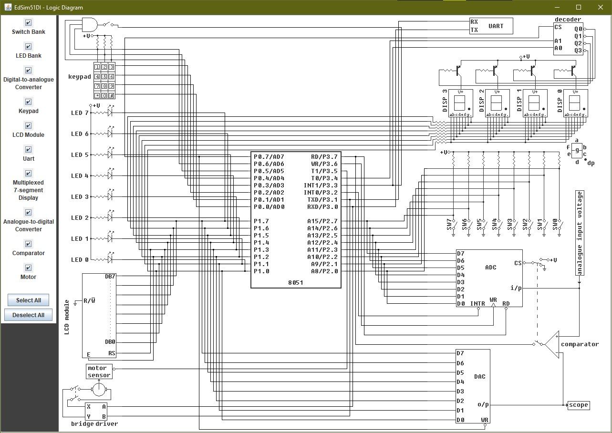

# Projeto 1
## Cronômetro Digital usando Assembly e 8051

### Integrantes:

|              Joao Pedro Gomes | 13839069 |
|------------------------------:|----------|
| Luana Hartmann Franco da Cruz | 13676350 |

### Estrutura do projeto

O arquivo principal deste projeto é o documento cronometro.asm, contendo o programa em linguagem assembly do processador 8051 com os devidos comentários.

Esta pasta também contém o documento PDF da especificação do projeto, forncecida pelo professor, bem como este documento com documentação adicional do programa em assembly.

### Execução do programa

O programa pode ser carregado e executado no simulador de 8051 [EdSim51](https://edsim51.com/). Foi utilizado o esquemático padrão do simulador (imagem abaixo)

### Funcionamento do programa

O projeto utiliza interrupções de clock para as funcoes de delay. Para isso, são escritos valores específicos em registradores de função especiais no início do código para habilitar interrupções e iniciar o timer 0 (que é dividido em dois registradores - TL0 e TH0 - de 8 bits cada) em modo apropriado.

Os clocks se iniciam em 0 e incrementam uma vez a cada ciclo de máquina (ou seja, a cada 1 microssegundo no clock padrão do simulador). A interrupcao ocorre no overflow de 65535 para 0, portanto ocorre uma interrupção a cada 65536 microssegundos. A fim de esperar 0,25 s entre chamadas de funções (requisito da especificação), é necessario esperar 250000 ciclos de maquina, o que significa 3 interrupcoes de clock + 53392 pulsos. Para isso, foi necessário usar o registrador R7 como contador de interrupções de clock e o R6 como flag de que o resto já foi contado.

Quando o resto não foi contado, é carregado o valor 2^16 - 53392 para os registradores de clock, a fim de esperar 53392 ciclos até a próxima interrupção. Quando o resto já foi contado, é chamada a função pulse_accordingly, encarregada de chamar increment_and_print de acordo com as chaves que estão pressionadas.

No caso de sw0 pressionado, a função increment_and_print é chamada sempre que pulse_accordingly é chamada. Caso sw1 esteja pressionado, increment_and_print deve ser chamada apenas uma vez a cada 4 chamadas de pulse_accordingly. Para isso, o registrador R1 é utilizado como um contador de chamadas de pulse_accordingly.

A função increment_and_print é encarregada de incrementar o registrador R0 (inicialmente 0) e chamar sua impressão caso seu valor não seja 10. Caso seu valor seja 10, é movimentado o dado 0 novamente para R0 antes de ser chamada sua impressão utilizando out_7seg.

A função out_7seg é bem simples: seu funcionamento consiste em testar qual dos valores de 0 a 9 o registrador R0 está atualmente e movimentar o valor correspondente para a porta P1, onde está conectado o display de 7 segmentos. Caso R0 não corresponda a nenhum valor, o display é apagado.