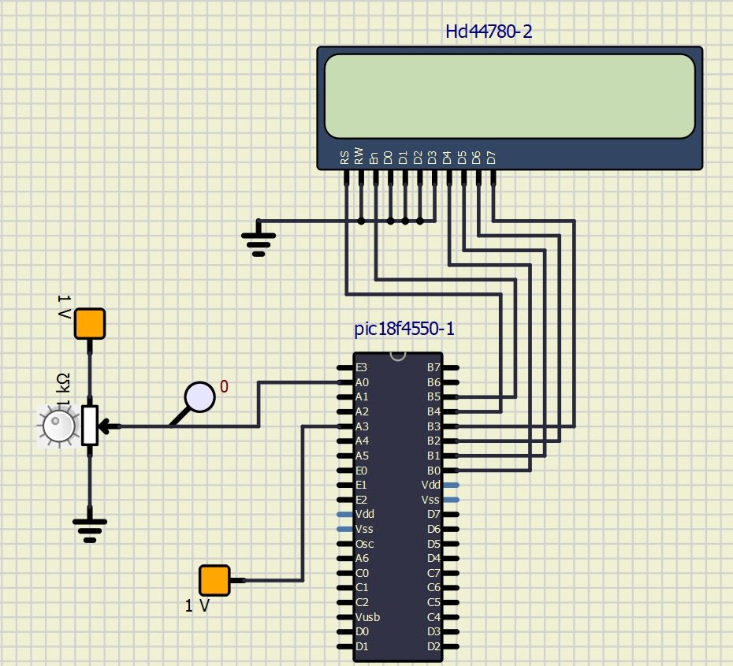

# Projeto 3 - Termômetro Digital com LM35 e Conversor A/D

## Termômetro utilizando PIC18F4550 e linguagem C

### Integrantes
|                          Nome | Nº USP   |
|------------------------------:|----------|
|    Gabriela Passos de Andrade | 12625142 |
|              João Pedro Gomes | 13839069 |
| Luana Hartmann Franco da Cruz | 13676350 |
|     Rafael Cunha Bejes Learth | 13676367 |

## Estrutura do Projeto
Este repositório inclui:
- O arquivo `.c` com o código em C para o microcontrolador PIC18F4550, configurado para ler um sensor de temperatura LM35 e exibir os valores em um display LCD.
- Documento PDF com especificação e requisitos do projeto.
- Este arquivo README com descrição do projeto, funcionamento e instruções de execução.

## Execução do Programa
O programa foi desenvolvido no compilador **MikroC PRO for PIC** e simulado no **SimulIDE**. O circuito inclui o PIC18F4550, um potenciômetro que simula o sensor de temperatura e um display LCD. Ao compilar e simular o circuito no SimulIDE, o potenciômetro simula a variação de temperatura de 0 a 100 °C no display LCD.

## Funcionamento do Programa
O projeto utiliza o módulo ADC para converter a tensão lida no pino conectado ao potenciômetro, que simula o sensor LM35, exibindo a temperatura de 0 a 100 °C no display LCD em formato "XX.X °C".

### Lógica de Conversão e Exibição
- **Sensor de Temperatura (Simulação)**: Utiliza um potenciômetro para variar a tensão e simular a temperatura de 0 a 100 °C. O Vref foi ajustado externamente (ADC_Init_Advanced(_ADC_EXTERNAL_VREFH)) para 0 a 1V, adequado à sensibilidade de 10 mV/°C do LM35.
- **Display LCD**: A temperatura lida é exibida em formato "XX.X °C" no display LCD, utilizando funções da biblioteca de LCD do MikroC.

## Implementação do Código

### Configuração Inicial
- **LCD**: Configurações dos pinos para o display, que incluem a definição dos bits do PORTB para controle do RS, EN e dos pinos de dados do display.
- **ADC**: O módulo ADC é inicializado com `ADC_Init_Advanced(_ADC_EXTERNAL_VREFH)`, configurando o Vref externo. 

### Funções Utilizadas
- **Lcd_Init()**: Inicializa o módulo LCD, preparando-o para receber dados.
- **Lcd_Cmd(_LCD_CLEAR)**: Limpa o display LCD, removendo qualquer texto anterior.
- **Lcd_Cmd(_LCD_CURSOR_OFF)**: Desativa o cursor no display LCD para uma apresentação mais limpa.
- **Lcd_Out(1,1,"ADC0:")**: Escreve o texto “ADC0:” na primeira linha, primeira coluna do display LCD, servindo como indicador para o valor de temperatura.
- **ADC_Init_Advanced(_ADC_EXTERNAL_VREFH)**: Inicializa o módulo ADC com Vref externo, ajustando-o para o intervalo de 0 a 1V, que é adequado para a sensibilidade do LM35.
- **ADC_Get_Sample(0)**: Lê o valor analógico do canal 0 e armazena em uma variável para conversão e exibição.
- **Lcd_Out**: Exibe o valor formatado da temperatura no display LCD.

### Procedimentos de Teste
1. **Compilação**: Compile o código no **MikroC PRO for PIC**.
2. **Simulação**: No **SimulIDE**, monte o circuito conforme o manual e ajuste o potenciômetro para observar a variação de temperatura no display.

## Formato de Entrega
Os arquivos a serem entregues são:
1. Documento com explicação textual dos conceitos (conversor A/D, configuração de registradores, ajuste de Vref e display LCD).
2. Imagem do circuito no SimulIDE.
3. Arquivo de simulação `.simu` do SimulIDE.
4. Arquivos `.hex` e `.c` compilados no MikroC PRO for PIC.

## Notas Finais
Este projeto explora o uso do conversor A/D e exibição em LCD, permitindo a prática na configuração de Vref, leitura de dados analógicos e manipulação de displays em sistemas embarcados.

