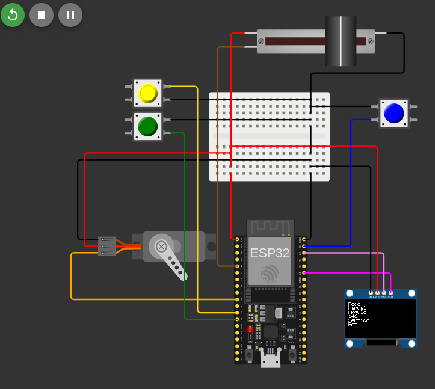
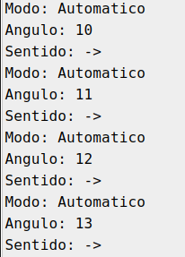
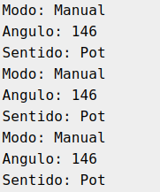
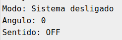

# Projeto 4 - Controle PWM e Comunicação - Programa 1  
## Projeto usando o simulador Wokwi

### Integrantes  
| Nome                           | Nº USP   |
|---------------------------------|----------|
| Gabriela Passos de Andrade      | 12625142 |
| João Pedro Gomes                | 13839069 |
| Luana Hartmann Franco da Cruz   | 13676350 |
| Rafael Cunha Bejes Learth       | 13676367 |

## Estrutura do Projeto  
Este repositório inclui:
- O arquivo `.ino` com o código em C para o microcontrolador ESP32, configurado para controlar um servo motor usando dois modos (automático e manual) com base na interação do usuário via botões e potenciômetro.
- Documento PDF com especificação e requisitos do projeto.
- Este arquivo README com descrição do projeto, funcionamento e instruções de execução.

## Execução do Programa  

### Funcionamento do Programa  
O programa controla um servo motor através de dois modos: automático e manual. A interação com o sistema é feita através de três botões físicos (loop, manual e stop) e um potenciômetro. O display OLED fornece feedback visual sobre o estado do sistema e a posição do servo.

#### Modo Automático
- O servo motor se move automaticamente de 0º a 180º e depois volta de 180º para 0º, repetidamente.
- A cada movimento, o display e o monitor serial mostram o modo ativo (Automático), o ângulo do servo e a direção do movimento.

#### Modo Manual
- O servo motor é controlado manualmente usando um potenciômetro. O valor do potenciômetro é lido e mapeado de 0 a 180 graus, ajustando a posição do servo.
- O display e o monitor serial exibem o modo Manual, o valor do ângulo e a origem do controle (Pot).

#### Botão Stop
- Ao pressionar o botão "Stop", o sistema é desligado. O servo é posicionado a 0º, e todos os modos são desativados.

### Lógica de Conversão e Exibição  
A posição do servo motor é gerenciada por dois modos:
1. **Modo Automático**: O servo move-se para posições pré-definidas (0º a 180º e vice-versa).
2. **Modo Manual**: O ângulo do servo é controlado com base no valor lido de um potenciômetro.

A cada movimento, o sistema atualiza o display OLED e o monitor serial com as informações:
- **Modo**: Indica se o sistema está no modo Automático ou Manual.
- **Ângulo**: O valor do ângulo atual do servo motor.
- **Sentido**: Indica a direção do movimento (→ ou ←).

## Implementação do Código

### Configuração Inicial  
- **Display OLED**: Usado para fornecer informações em tempo real sobre o estado do sistema.  
- **Botões**: 
  - `BUTTON_LOOP`: Alterna para o modo automático.
  - `BUTTON_MANUAL`: Alterna para o modo manual.
  - `BUTTON_STOP`: Desativa o sistema.
- **Servo Motor**: Controlado via PWM usando a biblioteca `ESP32Servo`.
- **Potenciômetro**: Usado no modo manual para controlar a posição do servo.

### Funções Utilizadas  
- **setup()**: Inicializa o display OLED, o servo motor, os botões e as configurações de pinos.
- **loop()**: Monitoriza os botões e alterna entre os modos automático, manual e o estado de parada.
- **automaticMode()**: Controla o movimento do servo no modo automático, movendo-o de 0º a 180º e vice-versa.
- **manualMode()**: Controla a posição do servo com base no valor lido do potenciômetro.
- **updateDisplayAndSerial()**: Atualiza o display OLED e o monitor serial com informações sobre o modo, o ângulo e a direção do movimento.

### Procedimentos de Teste  
1. **Teste de Modos**: Ao pressionar os botões "Loop" e "Manual", verifique se o sistema alterna corretamente entre os modos.
2. **Teste de Controle do Servo**: No modo manual, gire o potenciômetro e observe a resposta do servo motor. No modo automático, o servo deve mover-se de forma cíclica entre 0º e 180º.
3. **Teste de Parada**: Pressione o botão "Stop" para garantir que o sistema é desligado corretamente e o servo é posicionado em 0º.

### Imagem do circuito implementado no Wokwi

### Saída serial no modo automático

### Saída serial no modo manual com potenciômetro

### Saída serial no modo stop

## Formato de Entrega  
Os arquivos a serem entregues são:
1. Documento com explicação textual dos conceitos (controle PWM, uso do display OLED, controle de servo motor e configuração de botões).
2. Imagem do circuito no Wokwi.
3. Arquivo `.ino` com o código em C para o ESP32.

## Notas Finais  
Este projeto explora o uso de controle PWM para movimentar um servo motor, interação com o usuário via botões e potenciômetro, e exibição de informações em um display OLED. Ele permite a prática de controle de hardware, gerenciamento de entradas digitais e comunicação serial em sistemas embarcados.
