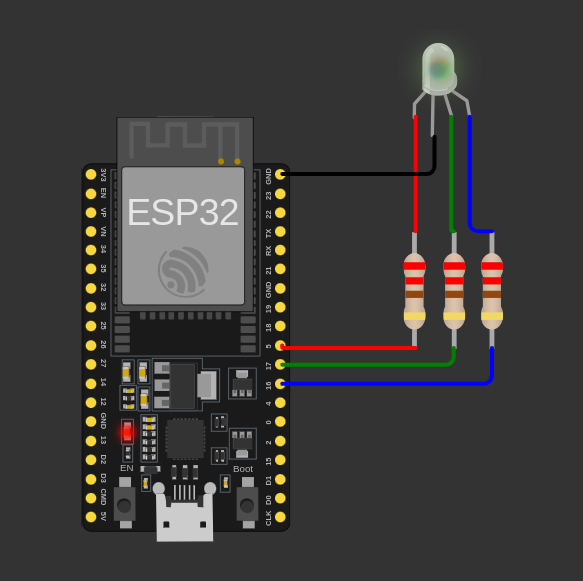
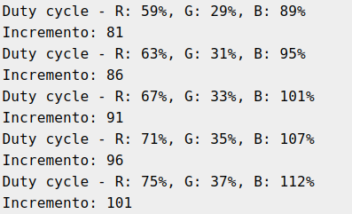

# Projeto PWM e Controle de LED RGB - Programas 1 e 2  
## Projeto usando o simulador Wokwi

### Integrantes  
| Nome                           | Nº USP   |
|---------------------------------|----------|
| Gabriela Passos de Andrade      | 12625142 |
| João Pedro Gomes                | 13839069 |
| Luana Hartmann Franco da Cruz   | 13676350 |
| Rafael Cunha Bejes Learth       | 13676367 |

## Estrutura do Projeto  
Este repositório inclui:
- O arquivo `.ino` com o código em C para o microcontrolador ESP32, configurado para controlar um LED RGB usando PWM.
- O código adaptado para a **Espressif IDE (ESP-IDF)**, que utiliza as funções do SDK para controle PWM em um ESP32.
- Documento PDF com especificação e requisitos do projeto.
- Este arquivo README com descrição do projeto, funcionamento e instruções de execução.

## Execução do Programa  

### Funcionamento do Programa  
O programa controla um LED RGB utilizando a técnica de modulação por largura de pulso (PWM). A intensidade de cada cor (vermelho, verde e azul) é controlada por um ciclo de trabalho (duty cycle), que varia continuamente em um intervalo.

#### No Código `.ino` (Usando Wokwi)
- O código utiliza a biblioteca `analogWrite()` para controlar os pinos de PWM do ESP32.
- O brilho de cada cor é ajustado de acordo com um incremento que varia entre 0 e 255.
- O LED muda sua cor dinamicamente, e as informações sobre o valor do incremento e os ciclos de trabalho de cada cor são exibidos no monitor serial.

#### No Código **ESP-IDF**
- A configuração é feita usando as funções do SDK ESP-IDF (`ledc_timer_config`, `ledc_channel_config`, `ledc_set_duty`).
- A intensidade de cada cor também é controlada por PWM, mas com uma resolução de 8 bits.
- A lógica é similar à do código Wokwi, mas utilizando as APIs do ESP-IDF.

### Lógica de Controle do LED RGB  
O controle do LED é feito pela variação do ciclo de trabalho de cada pino PWM conectado ao LED RGB:
1. **Vermelho (R)**: Controlado pelo pino 5.
2. **Verde (G)**: Controlado pelo pino 16.
3. **Azul (B)**: Controlado pelo pino 17.

Os ciclos de trabalho para cada cor são atualizados em um loop, onde os valores são incrementados para criar um efeito de transição entre cores.

## Implementação do Código

### Configuração Inicial  
- **LED RGB**: O controle do LED é realizado por PWM, utilizando os pinos 5, 16 e 17 para as cores vermelha, verde e azul, respectivamente.
- **PWM**: A configuração é feita com uma frequência de 5 kHz e resolução de 8 bits.
  
### Funções Utilizadas  
- **`setup()`**: Inicializa a configuração dos pinos de PWM e a comunicação serial.
- **`loop()`**: Atualiza os ciclos de trabalho das cores do LED, criando uma animação de transição.
  
### No Código `ino` (Wokwi)
- **`analogWrite()`**: Utilizada para ajustar o valor do duty cycle em cada cor do LED RGB.

### No Código `ESP-IDF`
- **`ledc_timer_config()`**: Configura o temporizador PWM.
- **`ledc_channel_config()`**: Configura os canais PWM para cada cor.
- **`ledc_set_duty()`**: Ajusta o valor do ciclo de trabalho de cada cor.
  
### Procedimentos de Teste  
1. **Teste de Cores**: O LED deve mudar de cor suavemente, com variações de intensidade entre vermelho, verde e azul.
2. **Teste de PWM**: As intensidades das cores devem variar corretamente entre 0 e 255. No caso do ESP-IDF, as configurações de duty cycle devem estar de acordo com a lógica esperada.

### Imagem do circuito implementado no Wokwi

### Saída serial no Wokwi

## Formato de Entrega  
Os arquivos a serem entregues são:
1. Documento com explicação textual dos conceitos (controle PWM, controle de LED RGB, modulação por largura de pulso).
2. Imagem do circuito no Wokwi.
3. Arquivo `.ino` com o código para o ESP32.
4. Arquivo `.cpp` com o código para o ESP32.

## Notas Finais  
Este projeto explora o uso de controle PWM para movimentar um servo motor, interação com o usuário via botões e potenciômetro, e exibição de informações em um display OLED. Ele permite a prática de controle de hardware, gerenciamento de entradas digitais e comunicação serial em sistemas embarcados.
